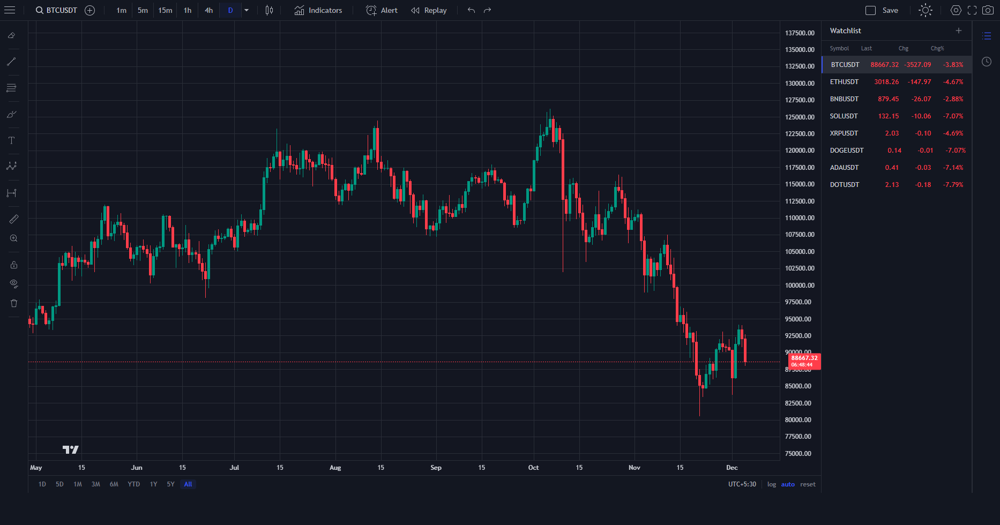

# lightweight-chart

A lightweight charting example using `lightweight-charts` and React.

## Quick start

- Clone the repo:

```bash
git clone https://github.com/crypt0inf0/lightweight-chart.git
```

- Change into the project directory:

```bash
cd lightweight-chart
```

- Install dependencies:

```bash
npm install
```

- Build for production:

```bash
npm run build
```

- Run the dev server:

```bash
npm run dev
```

You can also preview a production build locally with:

```bash
npm run preview
```

## Screenshot



## License

MIT